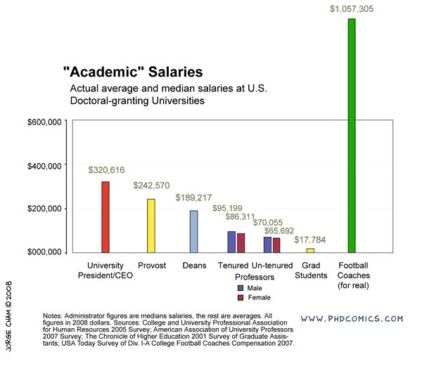
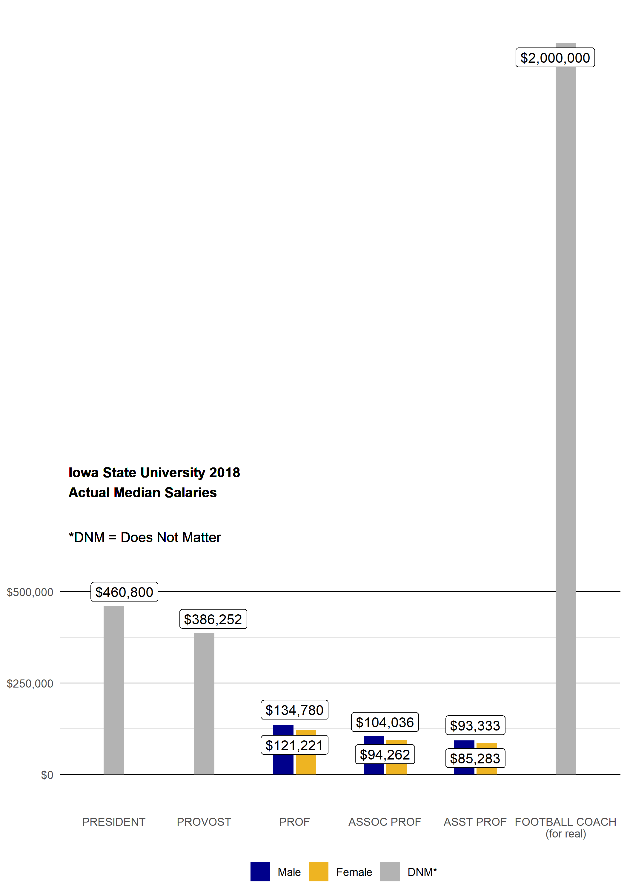

<!-- README.md is generated from README.Rmd. Please edit that file -->

```{r, include = FALSE}
knitr::opts_chunk$set(
  collapse = TRUE,
  comment = "#>",
  fig.path = "man/figures/README-",
  out.width = "100%"
)
```
# CyChecks2 

<!-- badges: start -->
[](https://www.tidyverse.org/lifecycle/#experimental)
<!-- badges: end -->

*Overview*

The goal of CyChecks2 is to allow users easy access to the publicly available Iowa State University (the Cyclones) employee salary data (their checks). 

Some of the services this access could offer include:

1. Aid job seekers in negotiating starting salaries.
2. Shed light on possible pay inequities with respect to gender.
3. Identify positions that are lacking gender diversity.

*Background*

In 2008 [PhDComics](http://phdcomics.com/comics/archive.php?comicid=1086) produced an interesting figure summarising US academic institution salaries:



One might wonder - are Iowa State University (ISU) salaries consistent with this national data? Using the CyChecks2 package one can find out!

The state of Iowa offers a large amount of public data at [this site](https://data.iowa.gov/). You can access the data with or without an API token, but can sign up for one [here](https://dev.socrata.com/foundry/data.iowa.gov/s3p7-wy6w). 
Iowa state employee salaries are available at [this site](https://data.iowa.gov/State-Finances/State-of-Iowa-Salary-Book/s3p7-wy6w). **CyChecks2 provides a function to easily scrape this data for any given year** 

The data from this site does not include the employee's home department. Unfortunately, to our knowledge the data linking names to departments is not easily accessible. ISU's Human Resources Department kindly provided a list of employees with their home departments and associated colleges valid from January 1 2008 - January 1 2018. Since acquiring this information is not reproducible to the average user, we've included a full dataset (with names anonymized) of all salary info (2007 - 2019) cross-referenced by department in the CyChecks2 package. Many employees (XX) appeared in the public data, but were not included in the list provided to us by ISU. This isn't ideal, and we hope ISU will provide complete public access to department affiliations in the future. 

*Summary*

This package currently includes:

1. Data from:
    (i) Salary/department dataset for employees with the string 'prof' in their position title, currently for fiscal years 2007-2018, accessed by calling **cyd_saldept**
    (ii) The same above dataset, but containing only the following categories:
    - assoc prof
    - asst prof
    - distg prof
    - morrill prof
    - prof
    - univ prof

  There is an additional column, prof_simp, which futher simplifies these categories to assoc, asst, awarded, and simply prof. This dataset is accessed by calling **cyd_salprofs**,
    
2. A shiny app for visualizing data (still in the works!)

## Installation

You can install the developmental version CyChecks2 from [github](https://CRAN.R-project.org) with:

``` r
devtools::install_github("https://github.com/lenglish/CyChecks2")
```

## Examples


With our package, we were able to partially recreate the PhDComics figure for the Cyclones in 2018. You can see that our data is not consistent with national averages: our football coach gets paid four times as much as the President, not twice as much. 




```{r echo = FALSE, results = FALSE}
# copy static figures to docs folder
file.copy("./README_files", "./docs", overwrite = TRUE, recursive = TRUE)
```
