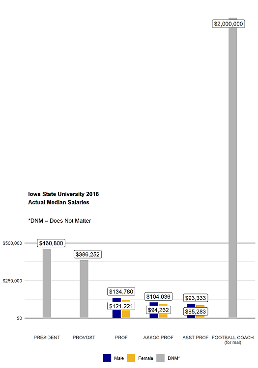

```{r setup, include = FALSE}
knitr::opts_chunk$set(echo = TRUE,  
                      fig.align = 'center', 
                      message = FALSE)
# Load packages
library(tidyverse)
```


# Overview
.pull-left[

.large[ 1. Motivation

2. Data cleaning & issues

3. Data visualization with Shiny

4. Data modeling (help!) ]]

.pull-right[

]

---

class: center

# Motivation

```{r, echo = FALSE}
knitr::include_graphics("figures/phdcomics.gif")
```

---

class: center

# Motivation

```{r, echo = FALSE, out.height= "50%", out.width="50%", fig.align='center'}

```

---

class: center

# Motivation

- Package for class in spring of 2019 (STAT 585)

- How does pay compare for women and men in the Agronomy department?

---

# Where does this data come from?


You (maybe) need an API to access it all

---

# Cleaning the data

### Two datasets

- Got rid of pay in hourly format
- Eliminated people with no gender or position listed
- Some departments are funded by two different colleges
  - EEOB-las vs EEOB-agls
  - Usually one has more people than the other - combined! 
- Filtered for 'PROF' titles only 
  
---
  
# Problems 
- More people in salary database than in Iowa State directory
  - 229 people with "prof" in their title. Not sure why, span various years and positions. Perhaps opted out of the directory. 
- Duplicate names! Directory doesn't include middle initials....
- Some departments have changed names..

