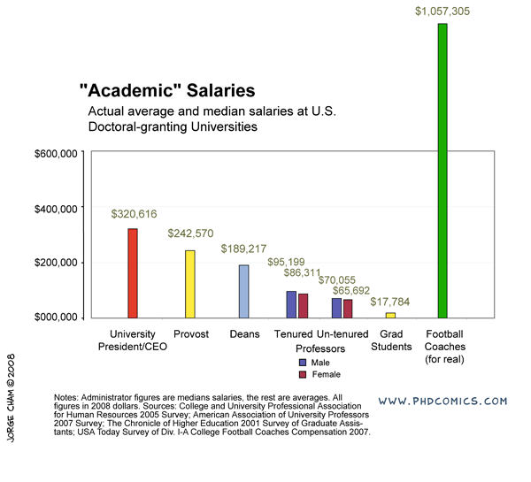

```{r setup, include = FALSE}
knitr::opts_chunk$set(echo = TRUE,  
                      fig.align = 'center', 
                      message = FALSE)

# Copying code to highlight lines
hook_source <- knitr::knit_hooks$get('source')
knitr::knit_hooks$set(source = function(x, options) {
  x <- stringr::str_replace(x, "^[[:blank:]]?([^*].+?)[[:blank:]]*#<<[[:blank:]]*$", "*\\1")
  hook_source(x, options)
})

# Load packages
library(tidyverse)
library(lme4)
library(lmerTest)
library(CyChecks)
library(CyChecks2)
```

### Overview
*** 
.pull-left[

.large[ 1. Motivation

2. Data cleaning & issues

3. Data visualization with Shiny

4. Data modeling (help!) ]]

.pull-right[

]

---

### Motivation
*** 
```{r, echo = FALSE}

```

---

### Motivation
*** 
.large[ 
- Final project for STAT 585, Spring 2019]

--
.large[
- How does pay compare for women and men in the Agronomy department?
]

---

### Data cleaning & issues
*** 
.large[Where does this data come from?]

[database](https://data.iowa.gov/Government-Employees/State-of-Iowa-Salary-Book/s3p7-wy6w/data)

.center[]


---

### Data cleaning & issues
*** 
#### Where does this data come from?
.tinyer[
```{r, tidy = TRUE}
sal_df<- function(limit= 1000, offset = 0, fiscal_year = 2007, token = NULL){
  checkmate::assertNumber(limit, lower = 0)
  checkmate::assertNumber(offset, lower = 0)
  checkmate::assertNumber(fiscal_year, lower =2007, upper = 2018)
  if (!is.null(token)){
 url <- sprintf("https://data.iowa.gov/resource/s3p7-wy6w.json?%s&$limit=%d&$offset=%d&$order=:id&department=Iowa%%20State%%20University&fiscal_year=%d", #<<
                token, limit, offset, fiscal_year) #<<
  } 
  else {
    url <- sprintf("https://data.iowa.gov/resource/s3p7-wy6w.json?$limit=%d&$offset=%d&$order=:id&department=Iowa%%20State%%20University&fiscal_year=%d", limit, offset, fiscal_year)
  }
  s <- tibble::as_tibble(jsonlite::fromJSON(url))
  checkmate::assertTibble(s, min.rows = 1, ncols =10)

  sals <- s %>%
    dplyr::select(-c(base_salary_date,department))%>%
    dplyr::mutate_at(dplyr::vars(fiscal_year, total_salary_paid, travel_subsistence), as.numeric)%>%
    dplyr::mutate(name = gsub(",","",name)) %>%
    dplyr::mutate(position = stringr::str_trim(position, side = "right"))

  checkmate::assertTibble(sals, min.rows = 1, ncols = 8)
  return(sals)
}
```
]
---
### Data cleaning & issues
*** 
#### Where does this data come from?
.tiny[
```{r}
{{ex <- sal_df(limit = 15, offset = 4500, fiscal_year = 2018)}}
knitr::kable(ex %>% select(-travel_subsistence), align = 'c', 'html') %>%
  kableExtra::kable_styling(font_size = 11, full_width = FALSE)
```
]
---
###  Data cleaning & issues
***
.large[Tidying government salary data]

--

- Got rid of pay in hourly format.

--

- Eliminated people with no gender or position listed.

--

- Filtered for _PROF_ titles only 


--

- Majority of people don't have a base salary listed, just a total salary paid. 
  - Most profs had base salary listed. 


---
###  Data cleaning & <span style="color:red">issues</span>
***

- Directory database from Iowa State University (2012 - 2019)

--

- More people in salary database than in Iowa State directory
  - 229 people with "prof" in their title. Not sure why, span various years and positions. Perhaps opted out of the directory? 

--

- **Duplicate names!** ISU directory doesn't include middle initials....
  - Went through by hand and googled those people

--

- Some departments have changed names over time
  - Ex. "curr/instr" is now "school of ed"

--

- 7 professors have a department listing of a center, but have a different "tenure home"  

--

- Some departments are funded by two different colleges:
  - EEOB-las vs EEOB-agls


---
### Data visualization with Shiny
***

[shiny!](https://vanichols.shinyapps.io/CyChecks2/)

---
### Data modeling (help!)
***
- Variables: Base salary; position, gender, department, fiscal year

--


- We want to know which departments don't have good gender representation or pay equity.
  - **Ideally we want to rank departments by (lack of) equity.**
  
--


- Not every department has M & F employeees in all positions 
  - How do we include those departments with no gender representation. NAs are meaningful!

---
### Data modeling (help!)
***
.large[*Response variable:*]
.pull-left[
.large[log(Salary)]
- Gender needs to be included in the model
]  
.pull-right[
.large[log(Ratio of Salaries)]
- Gender "effect" emcompassed in the response term
]  

---
### Data modeling (help!)
***

.large[*Response variable = log(salary) *]

```{r, echo = FALSE}
data("cyd_salprofs")
ex <- cyd_salprofs %>% 
  mutate(college = replace_na(college, "college of combos")) %>% # added this so we can include soc, eeob, etc. 
  filter(grepl("college", college)) %>% 
  mutate(lsal = log(base_salary)) %>% 
  filter(base_salary > 0) 

goodcmp <- 
  ex %>% 
  # make it so each person only counts once per position
  group_by(college, dept, prof_simp, gender, id) %>% 
  summarise(base_salary = mean(base_salary)) %>% 
  # keep only depts w/m and f in both positions AT SOME POINT in the dataset
  group_by(college, dept, prof_simp, gender) %>% 
  summarise(n = n()) %>% 
  spread(gender, value = n) %>% 
  # if NA get rid of that line
  filter(!is.na(`F`)) %>% 
  filter(!is.na(M)) %>% 
  select(college, dept, prof_simp)

ex_all <- # including ALL years
  goodcmp %>% 
  left_join(ex)

```


```{r}
m1a <- lmerTest::lmer(lsal ~ prof_simp * gender + (1 + gender|dept), data = ex_all)
```

- Filtered out position/department combos without both genders. 

- Repeated sampling of fiscal year encompassed within "dept" random effect...(?)
  - Adding name or fiscal year as a random effect doesn't work (model fails to converge)

---
### Data modeling (help!)
***

```{r, echo = FALSE}
sjPlot::tab_model(m1a, show.df = TRUE, show.aic = TRUE)
```

---
### Data modeling (help!)
***
.large[*Response variable = log(salary) *]

```{r, echo = FALSE}
# making ratio table
lrat_all <- ex %>% 
  group_by(fiscal_year, college, dept, prof_simp, gender) %>% 
  summarise(base_salary = mean(base_salary)) %>% 
  spread(gender, base_salary) %>% 
  mutate(rat = M/`F`,
         lrat = log(rat))
```

```{r}
m2a <- lmerTest::lmer(lrat ~ prof_simp + (1 | dept), data = lrat_all)
```

- Filtered out position/department combos without both genders. 

- Department is now just a random intercept term

---
### Data modeling (help!)
***

```{r, echo = FALSE}
sjPlot::tab_model(m2a, show.df = TRUE, show.aic = TRUE)
```


---
### Data modeling (help!)
***
```{r, echo = FALSE, dpi = 100, fig.height= 5.5}
# which depts have biggest effects on lrat? Show this...??!
as_tibble(ranef(m2a)) %>% 
  ggplot(aes(grp, condval)) +
  geom_col() + 
  labs(x = NULL, y = "Conditional Variance")+
  coord_flip()+
  theme_bw()
```

